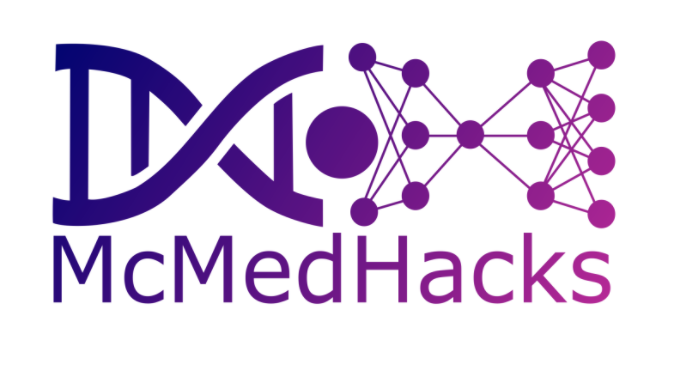

# McMedHacks 2021

[McMedHacks](https://mcmedhacks.com/) is a first of its kind to give hands-on experience with Deep Learning in Medical Imaging using Python programming language. McMedHacks is an initiative by McGill community to democratize medical imaging using Deep Learning and bring together people from various backgrounds to solve various technical challenges using AI in medical image analysis. 

This repo contains the curation of resources of the workshops hosted by McMedHacks from **June 21th - July31st 2021**. This repo will provide an opportunity to get access to the resources to those who might have missed an opportunity to attend this workshop. Also, since all the information is centralized in this single repository, it will be helpful to those who want to get a refresher at the amazing set of resources.

## Workshops Schedule
|Week  |Date       |About                               |Assignment                                                                                                                                                                 |Solutions                                                                                                                                                                  |
|------|-----------|------------------------------------|---------------------------------------------------------------------------------------------------------------------------------------------------------------------------|---------------------------------------------------------------------------------------------------------------------------------------------------------------------------|
|Week-1|June 12th  |Intro to Python for deep learning   | | |
|Week-2|June 19th  |Intro to deep learning              | | |
|Week-3| June 25th |Histopathology and image analysis   | | |
|Week-4|July 3rd   |CT and semantic segmentation        | | |
|Week-5| July 10th |Ultrasound and instance segmentation| | |
|Week-6|July 16th  |MR and GAN-based segmentation       | | |
|Week-7| July 24th |Multimodality and outcome prediction| | |
|Week-8|July 31st  |Closing ceremony                    | | |
